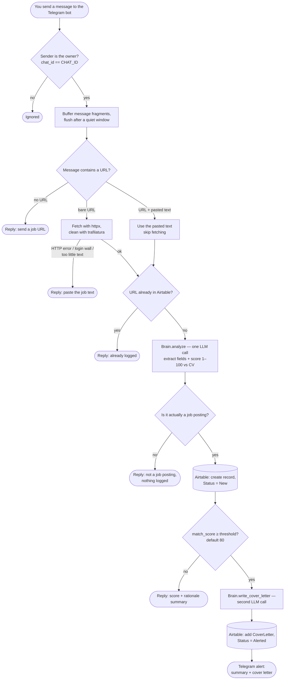

# job-application-bot

Stop triaging job boards by hand. **job-application-bot** turns a single Telegram message
into a scored, filed, ready-to-apply lead: send it a posting and it reads the
job, **rates the fit 1–100 against your CV**, files every result in an Airtable
CRM, and — for the matches worth your time — drafts a tailored cover letter and
pings you back. You only hear about the jobs that clear your bar; the rest are
logged quietly for later.

One **AI brain**, any backend. Point it at **Google Gemini**, **Anthropic
Claude**, or **any OpenAI-compatible endpoint** — OpenAI, NVIDIA NIM, Ollama,
llama.cpp, OpenRouter, vLLM, LM Studio, and friends — by flipping a single env
var. Run it on a free hosted model or fully offline on your own hardware.

Scoring a job is one LLM call and a cover letter a second, so it's cheap to run —
and pointing it at a local model keeps your CV and the jobs you're eyeing off
third-party servers entirely.

## Contents

- [How it works](#how-it-works)
- [Using the bot](#using-the-bot)
- [Prerequisites](#prerequisites)
- [Quick start](#quick-start)
- [Getting credentials](#getting-credentials)
- [Optional settings](#optional-settings)
- [Airtable schema](#airtable-schema)
- [Your CV](#your-cv)
- [Development](#development)
- [Troubleshooting](#troubleshooting)
- [License](#license)

---

## How it works

From the moment you send a message to the moment you get a score back:



The alert threshold defaults to **80** — and is configurable via
`ALERT_THRESHOLD` (see [Optional settings](#optional-settings)). The cover letter
is generated **only** for jobs that clear it; everything below is logged to the
CRM but not alerted.

---

## Using the bot

Everything happens inside Telegram. Open a chat with your bot and follow one of
these flows depending on the site.

### 1. Send a bare URL (most sites)

Paste a job posting URL and send it — nothing else in the message:

```
https://careers.example.com/jobs/senior-ai-engineer-123
```

The bot fetches the page, extracts the job description, scores it against your
CV, and logs the result to Airtable. Within a few seconds you get a reply:

> **Acme Corp — Senior AI Engineer**
> Score: 73/100
> Solid Python and LLM experience; lacks the MLOps depth the JD emphasises.

That's it. The record is in Airtable with `Status = New`.

### 2. Site blocks scraping (LinkedIn, Indeed, behind-login portals)

Some sites don't allow automated fetches. The bot detects this and asks:

> Couldn't extract text from that URL. Paste the full job description.

When that happens, go to the job page in your browser, select all the text, copy
it, and send a **single message** with the URL on the first line followed by the
pasted text:

```
https://www.linkedin.com/jobs/view/4419671758/
Senior AI Engineer at Acme Corp
We are looking for...
[rest of the job description]
```

The bot uses the pasted text directly — the URL is kept purely as a record of
where to apply — and the pipeline continues as normal.

### 3. High score (≥ threshold) — you get an alert and a cover letter

When the score clears your threshold (default 80) the bot sends a second message
with a tailored cover letter. The Airtable record is updated to `Status = Alerted`
and the cover letter is saved there too.

### 4. You've already submitted this job

If you send the same URL twice the bot checks Airtable first and replies
immediately:

> Already logged: **Acme Corp — Senior AI Engineer** (score 73).

Nothing is re-processed or double-logged.

### 5. Not a job posting

If the URL resolves to a homepage, article, search page, or error stub — rather
than an actual job posting — the LLM flags it and the bot replies:

> That doesn't look like a job posting — nothing was logged.

No Airtable record is created.

---

## Prerequisites

- **[uv](https://docs.astral.sh/uv/)** — the Python package/project manager used
  for everything here. Install it with the one-liner from
  <https://docs.astral.sh/uv/getting-started/installation/> (`uv` pulls in a
  matching Python itself, per `.python-version`, so you don't need one
  pre-installed).
- A **Telegram** account, an **Airtable** account, and an **API key** for one AI
  provider (Gemini / OpenAI-compatible / Anthropic) — all covered in
  [Getting credentials](#getting-credentials).
- **Optional:** **Docker** (with Docker Compose) if you'd rather run it in a
  container than directly.

## Quick start

**macOS / Linux (bash):**

```bash
uv sync                  # 1. install dependencies
cp .env.example .env     # 2. create your config, then fill it in (see below)
$EDITOR cv.md            # 3. add your CV as plain text (gitignored, never committed)
uv run job-application-bot          # 4. run
```

**Windows (PowerShell):**

```powershell
uv sync                          # 1. install dependencies
Copy-Item .env.example .env      # 2. create your config, then fill it in (see below)
notepad cv.md                    # 3. add your CV as plain text (gitignored, never committed)
uv run job-application-bot                  # 4. run
```

Or with Docker (any OS):

```bash
docker compose up -d
docker compose logs -f job-application-bot
```

### Verify it's running

`uv run job-application-bot` runs in the **foreground** and polls Telegram (no public
webhook needed). On a healthy start you'll see this log line:

```
[System]: job-application-bot started — polling for jobs
```

Then open Telegram, message your bot a job URL, and within a few seconds it
replies with a score. Press **Ctrl-C** to stop it. If startup instead exits with
a config error (e.g. `PROVIDER=… requires …`), fill in the missing `.env` values
and re-run. You can also `uv run python -m job_application_bot` instead of the `job-application-bot`
script — they're equivalent.

---

## Getting credentials

All configuration lives in `.env` (loaded via `python-dotenv` / pydantic-settings).
Copy `.env.example` to `.env` and fill in the values below. **Never commit `.env`
or `cv.md`.**

### Telegram — `TELEGRAM_BOT_TOKEN`, `CHAT_ID`

The bot is both how you submit jobs and how you receive alerts.

1. In Telegram, open a chat with **[@BotFather](https://t.me/BotFather)**.
2. Send `/newbot`, pick a name and a username. BotFather replies with a token like
   `123456789:AAEx...` → this is **`TELEGRAM_BOT_TOKEN`**.
3. Get your own numeric chat ID (the bot only obeys its owner): message
   **[@userinfobot](https://t.me/userinfobot)**, which replies with your `Id`
   → this is **`CHAT_ID`**. (Alternatively, send a message to your new bot, then
   open `https://api.telegram.org/bot<TOKEN>/getUpdates` and read `chat.id`.)

```dotenv
TELEGRAM_BOT_TOKEN=123456789:AAExampleTokenFromBotFather
CHAT_ID=716663514
```

### Airtable — `AIRTABLE_TOKEN`, `AIRTABLE_BASE`, `AIRTABLE_TABLE`

Airtable is the CRM where every scored job is logged.

1. Create a base with a table (see [Airtable schema](#airtable-schema) below for the
   exact fields). Name the table e.g. `Jobs`.
2. Create a **Personal Access Token** at
   <https://airtable.com/create/tokens> with these scopes:
   `data.records:read`, `data.records:write`, `schema.bases:read`, and **add your
   base** under "Access". The token (`pat...`) is **`AIRTABLE_TOKEN`**.
3. Find the **base ID** (`app...`): open <https://airtable.com/api>, pick your base
   — the ID is in the URL and docs. This is **`AIRTABLE_BASE`**.
4. **`AIRTABLE_TABLE`** is either the table name (`Jobs`) or its ID (`tbl...`).

```dotenv
AIRTABLE_TOKEN=patXXXXXXXXXXXXXX.XXXXXXXXXXXXXXXXXXXXXXXXXXXXXXXXXXXXXXXX
AIRTABLE_BASE=appXXXXXXXXXXXXXX
AIRTABLE_TABLE=Jobs
```

### The AI brain — pick one provider

Set **`PROVIDER`** to `gemini`, `openai`, or `anthropic`. Only the matching block's
keys need to be filled in.

```dotenv
# gemini | openai | anthropic
PROVIDER=gemini
```

#### Option A — Google Gemini (`PROVIDER=gemini`)

The project default. Free tier is generous and easily good enough for this.

1. Go to **[Google AI Studio → API keys](https://aistudio.google.com/apikey)** and
   create a key → **`GEMINI_API_KEY`**.
2. Pick a model (a fast one is fine for extraction/scoring). Check
   <https://ai.google.dev> for current names.

```dotenv
GEMINI_API_KEY=AIza...your-key
GEMINI_MODEL=gemini-2.5-flash
```

#### Option B — OpenAI **and any OpenAI-compatible endpoint** (`PROVIDER=openai`)

This one provider class covers a whole ecosystem. The only difference between
vendors is **`OPENAI_BASE_URL`** — leave it blank for OpenAI itself, or point it at
any server that speaks the OpenAI chat-completions API.

<details open>
<summary><b>Backends, key points, examples, and API-key links</b></summary>

| Backend | `OPENAI_BASE_URL` | `OPENAI_API_KEY` | `OPENAI_MODEL` (example) |
|---|---|---|---|
| **OpenAI** | *(blank)* | your `sk-...` key | `gpt-4o` |
| **NVIDIA NIM** | `https://integrate.api.nvidia.com/v1` | your NVIDIA key | `nvidia/nemotron-3-ultra-550b-a55b` |
| **Ollama** (local) | `http://localhost:11434/v1` | any non-empty value | `llama3.1` |
| **llama.cpp** (local) | `http://localhost:8080/v1` | any non-empty value | *(label only — ignored)* |
| **OpenRouter** | `https://openrouter.ai/api/v1` | your key | `google/gemma-3-12b-it` |

Key points:
- **`OPENAI_API_KEY` must be non-empty even when the server doesn't check it**
  (Ollama / llama.cpp). The OpenAI SDK refuses to start without one — use any
  placeholder like `sk-no-key-required`.
- For local servers, **`OPENAI_MODEL` is just a label** the server ignores — it
  serves whatever model you loaded. It still must be non-empty.
- **Running this app in Docker but the model on your host?** Use
  `http://host.docker.internal:8080/v1` (not `localhost`) — inside a container
  `localhost` is the container, not your machine.
- **Local models can be slow.** How long a job takes depends on model size,
  quantization, GPU layers offloaded (`-ngl`), and your hardware. A high-scoring
  job makes two sequential LLM calls (analysis + cover letter), so the total time
  can run into minutes. The pipeline gives up after `JOB_TIMEOUT_SECONDS` (default
  300) and replies *"That job took too long, so I gave up on it."* If you see that
  message, raise the value in `.env` to match your setup.

Examples:

```dotenv
# --- OpenAI ---
PROVIDER=openai
OPENAI_API_KEY=sk-...your-key
OPENAI_MODEL=gpt-4o
OPENAI_BASE_URL=

# --- NVIDIA NIM ---
PROVIDER=openai
OPENAI_API_KEY=nvapi-...your-key
OPENAI_MODEL=nvidia/nemotron-3-ultra-550b-a55b
OPENAI_BASE_URL=https://integrate.api.nvidia.com/v1

# --- Local llama.cpp / Ollama (app in Docker, model on host) ---
PROVIDER=openai
OPENAI_API_KEY=sk-no-key-required
OPENAI_MODEL=ggml-org/gemma-4-E4B-it-GGUF:Q8_0
OPENAI_BASE_URL=http://host.docker.internal:8080/v1
```

To get an API key for the hosted ones:
- **OpenAI:** <https://platform.openai.com/api-keys>
- **NVIDIA NIM:** <https://build.nvidia.com> → pick a model → "Get API Key"
- **OpenRouter:** <https://openrouter.ai/keys>
- **Ollama:** install from <https://ollama.com>, then `ollama pull <model>` and
  `ollama serve` (the OpenAI-compatible API is at `:11434/v1`).
- **llama.cpp:** build/download `llama-server`, then e.g.
  `llama-server -hf <repo>:<quant> -ngl 99 --jinja --port 8080`.

</details>

#### Option C — Anthropic Claude (`PROVIDER=anthropic`)

1. Create a key at **<https://console.anthropic.com/settings/keys>** →
   **`ANTHROPIC_API_KEY`**.
2. Set a current model name → **`ANTHROPIC_MODEL`**.

```dotenv
PROVIDER=anthropic
ANTHROPIC_API_KEY=sk-ant-...your-key
ANTHROPIC_MODEL=claude-sonnet-4-6
```

---

## Optional settings

These have sensible defaults — set them only if you want to override.

| Var | Default | What it does |
|---|---|---|
| `ALERT_THRESHOLD` | `80` | Match-score cutoff (inclusive). At or above it, a job gets a cover letter + Telegram alert; below it, the job is logged to the CRM only. Raise to be pickier, lower to catch more. |
| `OPENAI_BASE_URL` | *(blank)* | Point the OpenAI provider at any OpenAI-compatible endpoint (see [Option B](#option-b--openai-and-any-openai-compatible-endpoint-provideropenai)). |
| `JOB_TIMEOUT_SECONDS` | `300` | Wall-clock cap per job. Raise for slow local models, lower for fast hosted ones (see [Troubleshooting](#that-job-took-too-long-so-i-gave-up-on-it)). |

```dotenv
ALERT_THRESHOLD=80
JOB_TIMEOUT_SECONDS=300
```

> **Note:** `PROVIDER` is **required** and has no default — set it explicitly to
> `gemini`, `openai`, or `anthropic`. Only the selected provider's credential
> block needs filling in; the app validates those keys at startup and exits with a
> clear message if they're missing.

---

## Airtable schema

Create these fields in your table (names are case-sensitive):

| Field | Type |
|---|---|
| Company | Single line text |
| Role | Single line text |
| Link | URL |
| Tech | Long text |
| YearsRequired | Number |
| MatchScore | Number |
| Rationale | Long text |
| Status | Single select: `New` / `Alerted` / `Applied` / `Interviewing` / `Offer` / `Rejected` |
| CoverLetter | Long text |
| Added | Created time |

The pipeline only ever sets `Status = New` (on logging) and `Status = Alerted`
(when the score clears your threshold). The remaining statuses are manual stages
you move records through yourself.

---

## Your CV

Put your CV as plain text in **`cv.md`** at the repo root. It is loaded once at
startup and injected into both the scoring prompt and the cover-letter prompt, so
every job is scored against your real background. It is gitignored and never
committed.

---

## Development

```bash
uv run pytest                 # run the test suite
uv run ruff format            # format
uv run ruff check --fix       # lint
uv run python scripts/check_integrations.py   # manual, real-credential smoke test
```

> **Before running `check_integrations.py`:** edit the `JOB_URL` constant near the
> top of the script and replace the placeholder with a **real job-posting URL** —
> the URL→text check fetches it live, so it can't run against the placeholder.

---

## Troubleshooting

### "That job took too long, so I gave up on it"

The pipeline has a wall-clock cap on each job (`JOB_TIMEOUT_SECONDS`, default
300 s). When running a **local model** (llama.cpp, Ollama), how long a job takes
depends on model size, quantization, and how many layers are GPU-offloaded. A
high-scoring job makes two sequential LLM calls (analysis + cover letter), so the
total time can easily exceed the default on slow hardware.

Set a higher cap in `.env` and restart:

```dotenv
# Raise as needed — 600 s (10 min) is reasonable for large local models
JOB_TIMEOUT_SECONDS=600
```

A good starting point: time a single analysis call manually, double it to account
for the cover-letter pass, and add some margin.

---

### Docker: container can't reach the internet (`Network is unreachable` / Telegram `ConnectTimeout`)

**Symptom.** On `docker compose up` the bot crashes during startup with a
`telegram.ext` network retry loop and a traceback ending in `httpcore.ConnectTimeout`:

```
job-application-bot  | [telegram.ext] ERROR: Network Retry Loop (Bootstrap Initialize Application): Timed out
...
job-application-bot  | httpcore.ConnectTimeout
```

This is **not** an app bug — the container has no working route to the internet, so
it can't reach `api.telegram.org`. Confirm with a plain container:

```bash
docker run --rm busybox ping -c 2 8.8.8.8
# -> "Network is unreachable" (Errno 101) means it's a Docker host networking issue
```

**Fix (Docker Desktop).** Set the default networking mode to dual-stack:
**Settings → Resources → Network → Default networking mode → `Dual IPv4/IPv6`**
(it was on IPv4-only), then **Apply & restart** and bring the stack back up:

```bash
docker compose up -d
docker compose logs -f job-application-bot
```

---

## License

Released under the [MIT License](LICENSE) — © 2026 sagivt1.
